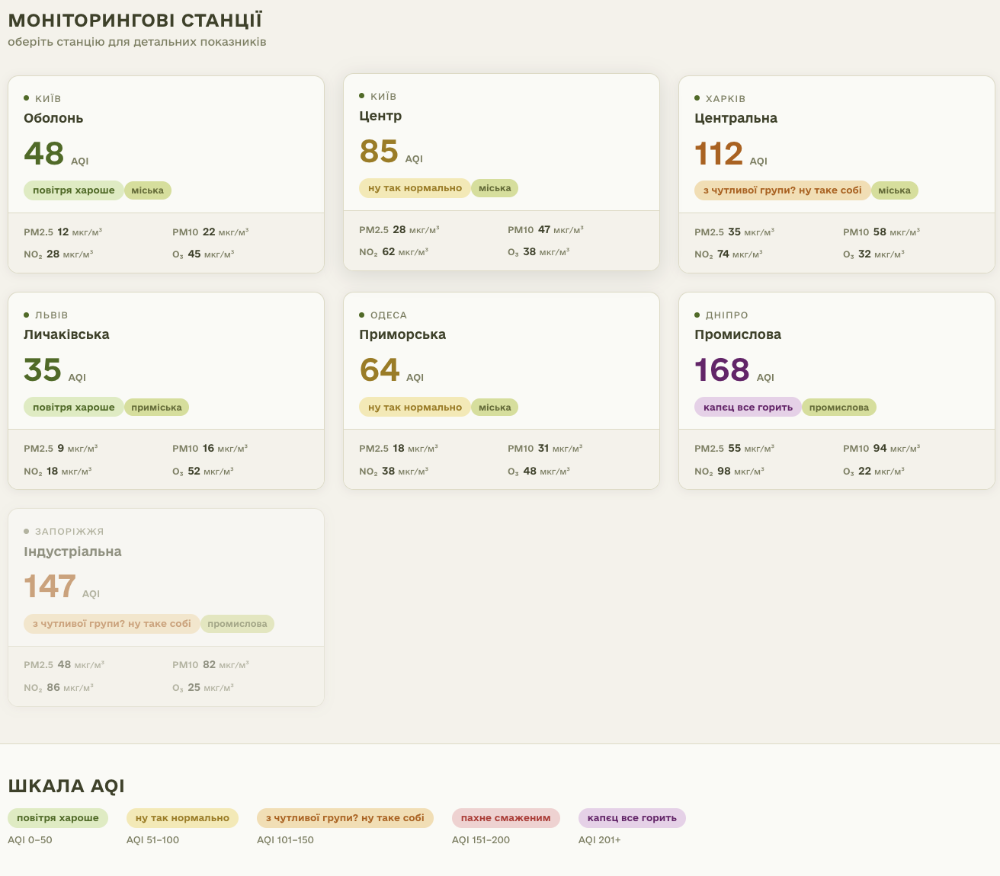
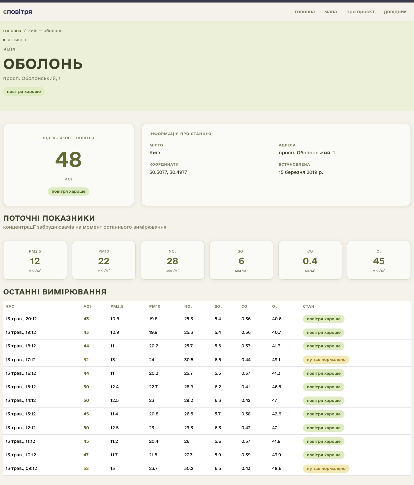
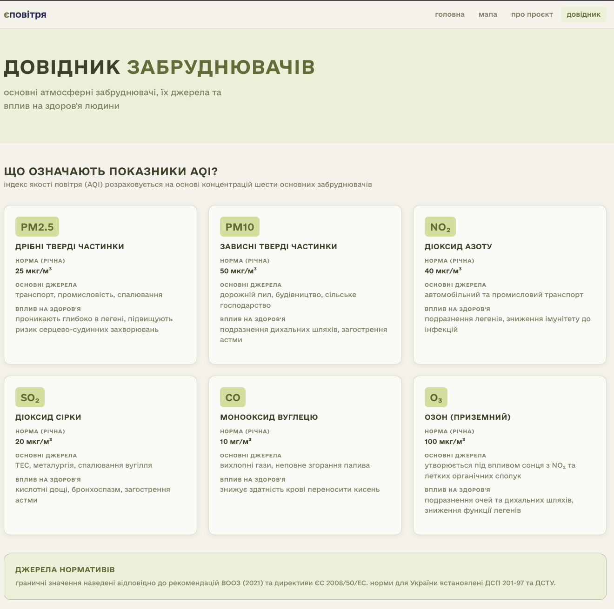
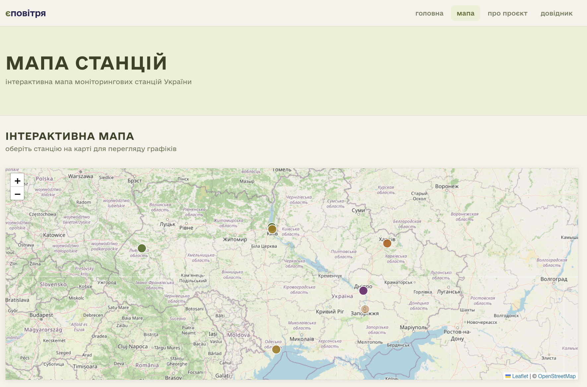
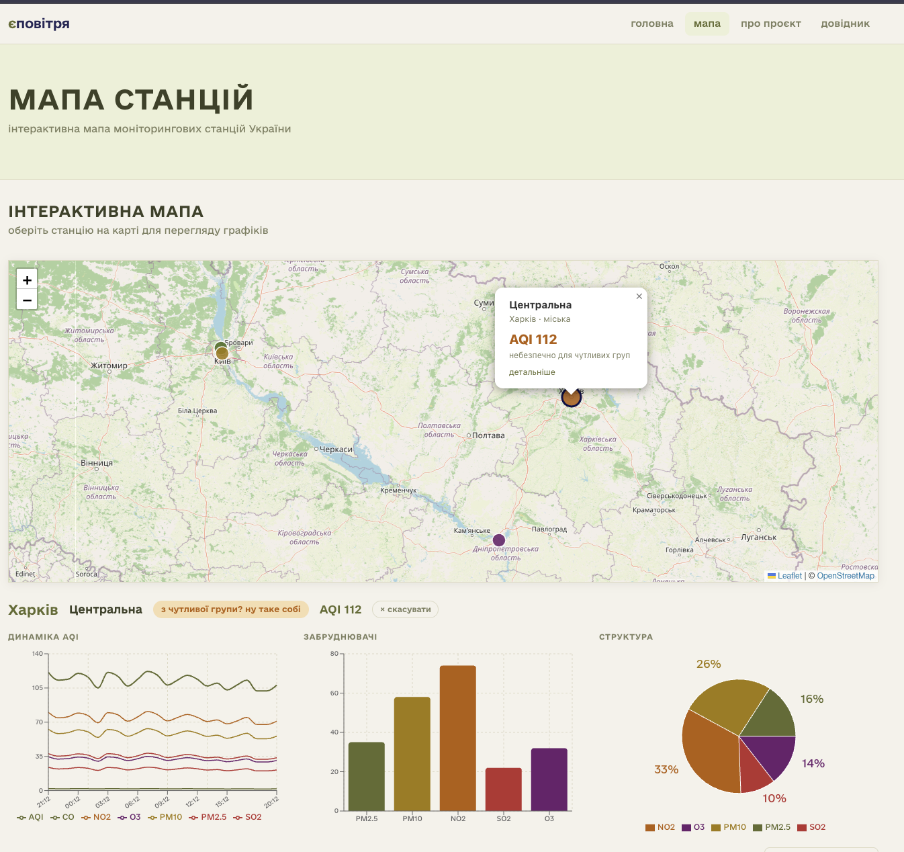
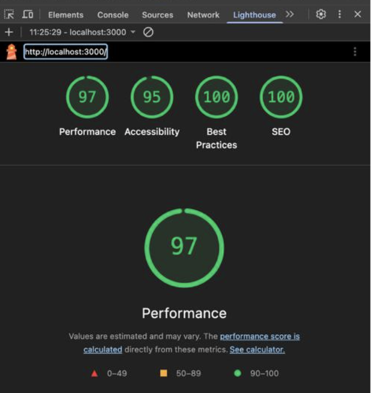
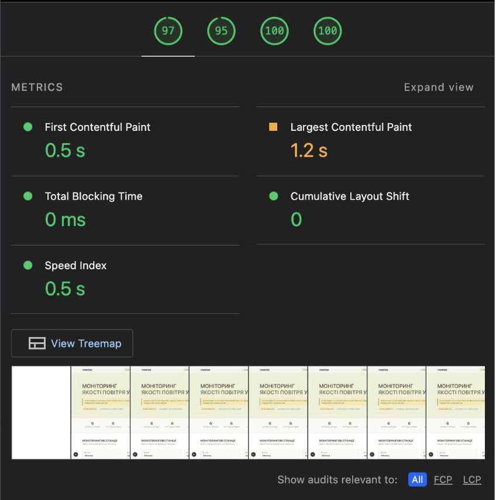
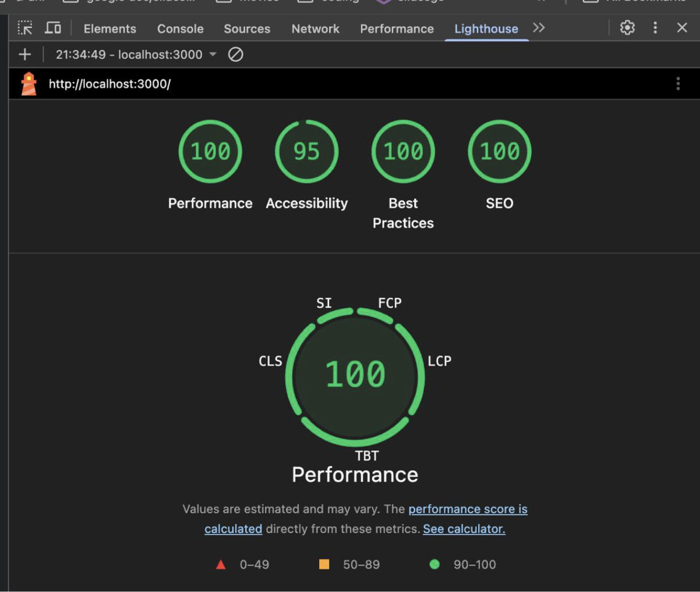
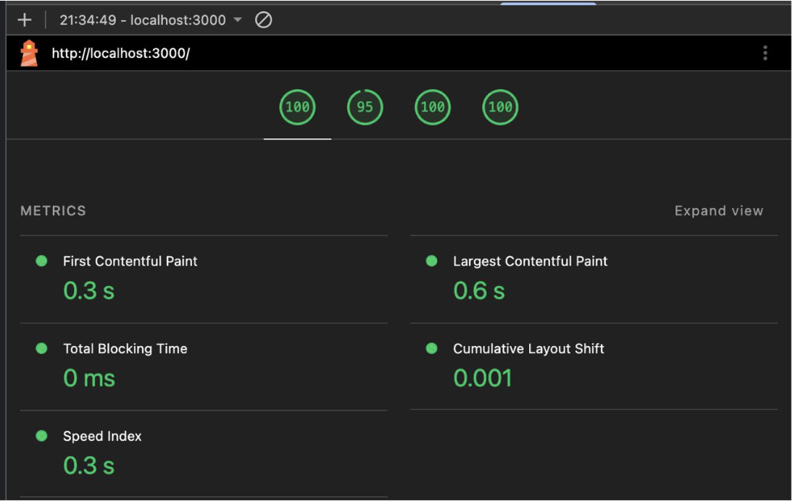

# єПовітря — звіти з лабораторних робіт

- [Лабораторна робота №1 — Next.js і TypeScript](#лабораторна-робота-1)
- [Лабораторна робота №2 — інтерактивна карта та графіки](#лабораторна-робота-2)
- [Лабораторна робота №3 — аналітика та логування](#лабораторна-робота-3)
- [Лабораторна робота №4 — оптимізація та деплой](#лабораторна-робота-4)

---

# Лабораторна робота №1

**Тема:** створення веб-додатку на Next.js і TypeScript для моніторингу екологічних даних.

**Мета:** отримати практичні навички побудови застосунку з серверним рендерингом, статичною генерацією сторінок, API-маршрутами та типобезпечною роботою зі структурованими даними.

## Структура проєкту

```
єПовітря/
├── app/
│   ├── layout.tsx              # кореневий layout: шрифти, навігація, футер, GA
│   ├── globals.css             # глобальні стилі
│   ├── page.tsx                # головна сторінка зі списком станцій (SSR)
│   ├── about/page.tsx          # сторінка про проєкт (SSG)
│   ├── guide/page.tsx          # довідник забруднювачів (SSG)
│   ├── map/page.tsx            # сторінка інтерактивної карти (SSG + CSR)
│   ├── station/[id]/page.tsx   # детальна сторінка станції (SSG)
│   ├── error.tsx               # кастомна сторінка 500
│   ├── not-found.tsx           # кастомна сторінка 404
│   ├── global-error.tsx        # глобальний обробник критичних помилок
│   └── api/
│       ├── current/route.ts        # GET /api/current
│       ├── measurements/route.ts   # GET /api/measurements
│       ├── stations/route.ts       # GET /api/stations
│       ├── stations/[id]/route.ts  # GET /api/stations/:id
│       └── log/route.ts            # POST /api/log
├── components/
│   ├── StationMap.tsx          # клієнтський компонент карти (Leaflet)
│   ├── StationCharts.tsx       # графіки показників (Recharts)
│   ├── MapPageClient.tsx       # клієнтська частина сторінки карти
│   ├── ErrorBoundary.tsx       # React Error Boundary
│   ├── WebVitals.tsx           # відстеження Core Web Vitals
│   ├── AnalyticsEvent.tsx      # компонент для надсилання GA-подій
│   ├── AqiBadge.tsx            # кольорова індикація AQI
│   ├── Navbar.tsx              # навігаційна панель
│   ├── Footer.tsx              # футер
│   └── StationCard.tsx         # картка станції
├── lib/
│   ├── data.ts                 # mock-дані станцій і генератор вимірювань
│   ├── analytics.ts            # функції відстеження GA-подій
│   └── logger.ts               # власний JSON-логер
├── types/
│   └── index.ts                # TypeScript-типи та інтерфейси
├── public/
│   └── fonts/                  # шрифти e-Ukraine (Regular, Bold, Medium тощо)
├── next.config.ts
├── tsconfig.json
└── package.json
```

### Призначення основних каталогів

`app/` містить сторінки, layout і серверні API-маршрути. Тут реалізовано основну логіку інтерфейсу та отримання даних.

`components/` зберігає модульні компоненти — карту, графіки, навігацію, обробники помилок та утиліти аналітики. Усі компоненти, що потребують браузерних API, позначено директивою `'use client'`.

`lib/` містить дані станцій і вимірювань, функції відстеження подій GA та власний JSON-логер.

`types/` визначає спільні TypeScript-інтерфейси, що використовуються і на сервері, і на клієнті.

## TypeScript-інтерфейси

У файлі `types/index.ts` описано такі основні типи та інтерфейси:

`StationType` — рядковий union-тип станції: `"міська" | "приміська" | "промислова" | "сільська"`.

`AirQualityCategory` — рядковий union-тип категорії якості повітря (від "добре" до "дуже небезпечно").

`Coordinates` — координати станції: `{ lat: number; lng: number }`.

`AirQualityData` — показники якості повітря: PM2.5, PM10, NO2, SO2, CO, O3, AQI та категорія.

`MonitoringStation` — повний опис станції: ідентифікатор, назва, місто, адреса, координати, тип, статус активності (`isActive`), дата встановлення та поточні дані (`currentData`).

`Measurement` — одне вимірювання: ідентифікатор станції, мітка часу та об'єкт `data` типу `AirQualityData`.

`ApiResponse<T>` — універсальний формат відповіді API: `{ success, data, meta? }`.

`ResponseMeta` — метадані пагінації: `{ total, page, limit, totalPages }`.

`ApiError` — структура помилки: `{ success: false, error: string, code: number }`.

`StationsQueryParams` — параметри запиту списку станцій: `city`, `type`, `page`, `limit`, `sort`, `order`.

`MeasurementsQueryParams` — параметри запиту вимірювань: `stationId`, `from`, `to`, `page`, `limit`.

Спільні типи знижують ризик помилок під час роботи з даними та забезпечують узгодженість між серверною і клієнтською частинами.

## SSR, SSG та призначення сторінок

### SSR

Головна сторінка `app/page.tsx` позначена `export const dynamic = "force-dynamic"`, тому HTML формується на сервері під час кожного запиту. SSR доцільний тут, бо загальна статистика AQI та список станцій відображаються актуальними на момент запиту.

### SSG

Сторінки `app/about/page.tsx` і `app/guide/page.tsx` генеруються під час збірки — їхній вміст змінюється рідко, тому немає потреби відтворювати їх на кожен запит.

Сторінка `app/station/[id]/page.tsx` також статична: вона використовує `generateStaticParams()`, який повертає ідентифікатори всіх станцій, і Next.js будує окрему HTML-сторінку для кожної станції під час збірки.

```ts
export async function generateStaticParams() {
  return stations.map((s) => ({ id: s.id }));
}
```

### SSG + CSR

Сторінка карти `app/map/page.tsx` статична на рівні Next.js (без `force-dynamic`), але інтерактивна частина — карта і графіки — завантажується на клієнті через динамічні імпорти в `MapPageClient.tsx`.

### Коли використовувати ISR

ISR доцільно застосовувати для сторінок, де вміст оновлюється рідше, ніж на кожен запит, але частіше, ніж при кожній збірці. Для цього проєкту такими сторінками могли б бути:

- добові або тижневі звіти по станціях;
- сторінки з агрегованою аналітикою по районах;
- дашборд із підсумками за останні 24 години.

## API та приклади запитів

### GET /api/stations

Повертає список станцій із підтримкою фільтрації та сортування.

Приклад запиту:

```text
GET /api/stations?city=Київ&type=міська&sort=aqi&order=desc&page=1&limit=10
```

### GET /api/stations/:id

Повертає деталі конкретної станції.

Приклад запиту:

```text
GET /api/stations/kyiv-center
```

### GET /api/measurements

Повертає вимірювання для станції з фільтрацією за діапазоном дат і пагінацією.

Приклад запиту:

```text
GET /api/measurements?stationId=kyiv-center&from=2026-04-01T00:00:00Z&to=2026-04-07T00:00:00Z&page=1&limit=24
```

### GET /api/current

Повертає поточні показники для всіх станцій або для конкретної (якщо передано `stationId`).

Приклад запиту:

```text
GET /api/current
GET /api/current?stationId=kyiv-center
```

### POST /api/log

Приймає JSON-об'єкт і записує його до серверного логу. Використовується `ErrorBoundary` і сторінкою `error.tsx` для передачі помилок на сервер.

### Приклад успішної відповіді

```json
{
  "success": true,
  "data": [
    {
      "stationId": "kyiv-center",
      "city": "Київ",
      "name": "Центр",
      "pm25": 28,
      "pm10": 47,
      "no2": 62,
      "so2": 14,
      "co": 1.1,
      "o3": 38,
      "aqi": 85,
      "category": "задовільно"
    }
  ]
}
```

### Приклад помилки

```json
{
  "success": false,
  "error": "Параметр stationId є обов'язковим",
  "code": 400
}
```

## Ключові фрагменти коду

### Сувора типізація

У `tsconfig.json` увімкнено суворий режим TypeScript (`strict: true`). Компілятор виявляє більше помилок ще до запуску застосунку.

```json
{
  "compilerOptions": {
    "strict": true,
    "noEmit": true,
    "target": "ES2017",
    "module": "esnext",
    "moduleResolution": "bundler"
  }
}
```

### Серверний рендеринг головної сторінки

```tsx
export const dynamic = "force-dynamic";

export default async function HomePage() {
  const activeCount = stations.filter((s) => s.isActive).length;
  const avgAqi = getAverageAqi();
  const overallCategory = getOverallCategory();
  const cities = [...new Set(stations.map((s) => s.city))].length;

  return (
    <>
      <section className="hero-section">...</section>
      <section className="stats-strip">...</section>
    </>
  );
}
```

Дані обчислюються на сервері за допомогою функцій з `lib/data.ts` перед рендером сторінки.

### Типобезпечний API-формат

```ts
export interface ApiResponse<T> {
  success: boolean;
  data: T;
  meta?: ResponseMeta;
}

export interface ResponseMeta {
  total: number;
  page: number;
  limit: number;
  totalPages: number;
}
```

Завдяки дженерикам структура відповіді однакова для різних типів даних і залишається строго типізованою.

### Валідація запиту в API

```ts
if (!stationId) {
  logger.warn("measurements: missing stationId param");
  return Response.json(
    { success: false, error: "Параметр stationId є обов'язковим", code: 400 },
    { status: 400 },
  );
}
```

## Відповіді на контрольні питання

### 1. Переваги серверного рендерингу для додатків з науковими даними

SSR особливо корисний у проєктах з екологічним моніторингом, оскільки:

- перший вміст показується швидше, бо HTML приходить уже готовим;
- пошукові системи краще індексують контент;
- важкі обчислення виконуються на сервері, не перевантажуючи браузер;
- дані відображаються актуальними на момент запиту;
- простіше контролювати формат і цілісність даних.

### 2. Як TypeScript підвищує надійність коду

TypeScript зменшує кількість помилок завдяки статичній перевірці типів, спільним інтерфейсам і обмеженню допустимих значень. Для екологічних даних це важливо, бо структура вимірювань має бути стабільною: одне неправильне поле або невірний тип можуть зламати розрахунок AQI чи відображення графіків.

У цьому проєкті TypeScript допомагає:

- описати структуру станцій та вимірювань (`MonitoringStation`, `AirQualityData`);
- безпечно працювати з параметрами API (`StationsQueryParams`, `MeasurementsQueryParams`);
- використовувати однакові типи на сервері й клієнті;
- отримувати підказки в редакторі та швидше знаходити помилки.

### 3. Коли доцільно використовувати SSR, SSG та ISR

SSR варто використовувати для даних, що часто змінюються. У цьому проєкті це головна сторінка з актуальною статистикою.

SSG підходить для майже незмінного або рідко оновлюваного контенту. Тут це сторінки «Про проєкт», «Довідник забруднювачів» і сторінки станцій (попередньо побудовані через `generateStaticParams`).

ISR доцільний, коли сторінку потрібно оновлювати periodically, але не на кожен запит. Наприклад, для щоденного зведення по якості повітря або тижневої статистики.

### 4. Принципи організації API

Щоб API було масштабованим, у проєкті дотримуються таких принципів:

- чіткий поділ ресурсів на окремі маршрути;
- однаковий формат успішних відповідей і помилок;
- валідація вхідних параметрів з поверненням коду 400;
- пагінація для великих списків;
- фільтрація та сортування через query-параметри;
- повторне використання спільних типів;
- структуроване логування через `logger.info` / `logger.warn` / `logger.error`.

### 5. Типобезпечна взаємодія між клієнтом і сервером

Безпечна взаємодія реалізується через спільні типи в `types/index.ts`. Серверні маршрути повертають дані у форматі `ApiResponse<T>`, а клієнтські компоненти працюють з такими ж інтерфейсами. Це дає однакове розуміння структури даних на обох сторонах і зменшує шанси на помилки під час зміни API.

## Скріншоти

### 1. Головна сторінка




### 2. Сторінка станції



### 3. Сторінка «Про проєкт»


### 4. Довідник забруднювачів



## Висновки

У ході лабораторної роботи створено веб-додаток єПовітря для моніторингу якості повітря. Реалізовано серверний рендеринг для головної сторінки, статичну генерацію для довідкових сторінок і детальних сторінок станцій через `generateStaticParams`, п'ять API-маршрутів з валідацією та типобезпечну спільну модель даних.

Проєкт показує, що Next.js з App Router підходить для наукових та екологічних даних, а TypeScript робить обробку структурованої інформації надійнішою і передбачуванішою.

---

# Лабораторна робота №2

**Тема:** інтеграція інтерактивної карти та графіків.

**Мета:** навчитися інтегрувати картографічні бібліотеки та інструменти візуалізації для створення інтерактивного інтерфейсу відображення екологічних даних.

## Нові залежності

До проєкту додано дві бібліотеки:

- `leaflet` та `react-leaflet` — для відображення інтерактивної карти на основі OpenStreetMap;
- `recharts` — для побудови графіків на основі SVG + React.

Встановлення:

```bash
npm install leaflet react-leaflet recharts
npm install --save-dev @types/leaflet
```

## Нова структура файлів

```
components/
  StationMap.tsx       # клієнтський компонент карти (CircleMarker, Popup, ZoomTracker)
  StationCharts.tsx    # всі три типи графіків в одному компоненті (Recharts)
  MapPageClient.tsx    # клієнтська частина: динамічний імпорт карти і графіків
app/
  map/page.tsx         # серверна обгортка сторінки карти (SSG)
```

## Частина 1. Інтерактивна карта

### Особливості інтеграції Leaflet у Next.js

Leaflet напряму звертається до браузерних API (`window`, `document`), яких немає під час серверного рендерингу. Щоб уникнути помилки `window is not defined`, компонент карти підключається через `next/dynamic` з параметром `ssr: false` у `MapPageClient.tsx`:

```tsx
const StationMap = dynamic(() => import("./StationMap"), {
  ssr: false,
  loading: () => <div>завантаження карти…</div>,
});
```

Компонент `StationCharts` також підключається через `dynamic` — він завантажується лише після того, як користувач обрав станцію:

```tsx
const StationCharts = dynamic(() => import("./StationCharts"), {
  loading: () => <div>завантаження графіків…</div>,
});
```

### Маркери з кольоровим кодуванням

Замість стандартних іконок Leaflet використовуються `CircleMarker` з кольоровим заповненням. Колір визначається категорією AQI через словник `AQI_COLORS`:

```tsx
const AQI_COLORS: Record<AirQualityCategory, string> = {
  добре: "#4a6b1a",
  задовільно: "#a07a00",
  "небезпечно для чутливих груп": "#b55e00",
  небезпечно: "#b83030",
  "дуже небезпечно": "#6b1f6b",
};
```

Маркер обраної станції отримує більший радіус і темну обводку для виділення:

```tsx
<CircleMarker
  center={[s.coordinates.lat, s.coordinates.lng]}
  radius={isSelected ? 14 : 10}
  pathOptions={{
    fillColor: color,
    fillOpacity: s.isActive ? 0.88 : 0.4,
    color: isSelected ? "#0f0e47" : "#ffffff",
    weight: isSelected ? 3 : 1.5,
  }}
  eventHandlers={{ click: () => onSelect(s.id) }}
>
  <Popup>...</Popup>
</CircleMarker>
```

### Відстеження зуму

У компоненті карти є внутрішній компонент `ZoomTracker`, який відстежує зміни масштабу і передає їх до GA:

```tsx
function ZoomTracker() {
  useMapEvents({
    zoomend(e) {
      trackMapZoom(e.target.getZoom() as number);
    },
  });
  return null;
}
```

### Скріншот карти зі станціями



## Частина 2. Графіки

Усі три типи графіків реалізовано в одному файлі `components/StationCharts.tsx`. Компонент є клієнтським (`'use client'`) і отримує дані через пропси — обчислення залишаються на сервері.

### Лінійний графік — динаміка AQI

Відображає зміни AQI, PM2.5, PM10, NO2, SO2, CO і O3 за останні 24 вимірювання для обраної станції. `dot={false}` прибирає крапки на вузлових точках, що покращує читабельність при великій кількості точок. Натискання на елемент легенди приховує або показує відповідну лінію:

```tsx
<LineChart data={lineData}>
  <Line
    type="monotone"
    dataKey="AQI"
    stroke="#636b2f"
    dot={false}
    hide={hiddenLines["AQI"]}
    isAnimationActive={false}
  />
  ...
  <Legend onClick={handleLegendClick} />
</LineChart>
```

### Стовпчаста діаграма — забруднювачі

Порівнює концентрації PM2.5, PM10, NO2, SO2 і O3 для поточного вимірювання обраної станції. Кожен стовпчець забарвлений індивідуально — колір задається в масиві `barData` через поле `fill`.

### Кругова діаграма — структура забруднення

Відображає частку кожного забруднювача у загальній сумі концентрацій поточного вимірювання. Використовує ті ж дані, що й стовпчаста діаграма.

### Скріншот графіків



## Частина 3. Інтеграція карти та графіків

### Архітектура зв'язку між компонентами

Спільний стан `selectedId` живе в `MapPageClient.tsx` і передається і в `StationMap`, і в `StationCharts`. Коли користувач клікає на маркер, карта викликає колбек `onSelect(id)`. Компонент `MapPageClient` оновлює стан, знаходить станцію і передає відповідні вимірювання в `StationCharts`:

```tsx
const [selectedId, setSelectedId] = useState<string | null>(null);
const selected = stations.find((s) => s.id === selectedId) ?? null;
const selectedMeasurements = selectedId ? (measurements[selectedId] ?? []) : [];

function handleSelect(id: string) {
  setSelectedId(id);
  trackMapMarkerClick(id);
}
```

### Розподіл серверної та клієнтської логіки

Серверна сторінка `app/map/page.tsx` готує дані — завантажує всі станції і словник вимірювань з `lib/data.ts` — і передає їх як пропси в `MapPageClient`. Вся інтерактивність (стан, динамічні імпорти) залишається на клієнті. Це стандартний патерн App Router.

### Обгортка через ErrorBoundary

Карта і графіки загорнуті в `ErrorBoundary` з різними `context`, щоб помилка в одному блоці не руйнувала весь інтерфейс:

```tsx
<ErrorBoundary context="station-map">
  <StationMap ... />
</ErrorBoundary>

<ErrorBoundary context="station-charts">
  <StationCharts ... />
</ErrorBoundary>
```

## Відповіді на контрольні питання

### 1. Чому виникають проблеми при інтеграції картографічних бібліотек у Next.js і як їх вирішити?

Проблеми виникають через те, що Next.js використовує серверний рендеринг, тоді як бібліотеки на кшталт Leaflet працюють лише в браузері та залежать від об'єктів `window` і `document`. Через це з'являються помилки під час рендерингу на сервері. Вирішується це шляхом вимкнення SSR для таких компонентів через `next/dynamic` з параметром `ssr: false`.

### 2. Які типи графіків найкраще підходять для візуалізації різних екологічних показників?

Лінійні графіки доцільно використовувати для відображення змін показників у часі — наприклад, динаміки AQI за 24 години. Стовпчикові діаграми добре підходять для порівняння концентрацій різних забруднювачів поточного вимірювання. Кругові діаграми використовуються для показу структури забруднення — тобто частки кожної речовини у загальній сумі.

### 3. Як організувати ефективну взаємодію між різними компонентами інтерфейсу?

Ефективна взаємодія між компонентами інтерфейсу організовується через спільний стан. Дані про обрану станцію зберігаються в батьківському компоненті (`MapPageClient`), а дочірні компоненти отримують їх через props. Коли користувач натискає на маркер на карті, стан оновлюється і відповідно змінюється відображення графіків.

### 4. Які фактори впливають на продуктивність карти при великій кількості маркерів?

Продуктивність карти при великій кількості маркерів залежить від обсягу відображуваних даних, частоти перерендерів компонентів і складності візуальних елементів, таких як спливаючі вікна. Велика кількість маркерів може суттєво сповільнювати роботу інтерфейсу. Для оптимізації використовуються кластеризація маркерів, зменшення кількості одночасно відображуваних елементів та техніки оптимізації React-компонентів (`React.memo`, `useMemo`).

## Висновки

У ході лабораторної роботи реалізовано інтерактивну карту моніторингових станцій на основі Leaflet із кольоровим кодуванням за категорією AQI через `CircleMarker` та спливаючими вікнами. Підключено три типи графіків через Recharts в єдиному компоненті `StationCharts`. Карту та графіки пов'язано через спільний стан у `MapPageClient`. Динамічні імпорти для карти і графіків реалізовані там само, що виключає ці важкі бібліотеки з початкового JS-bundle.

---

# Лабораторна робота №3

**Тема:** впровадження аналітики та логування.

**Мета:** навчитися інтегрувати системи веб-аналітики для відстеження користувацької активності та реалізувати серверне логування для моніторингу роботи додатку.

## Нові залежності

```bash
npm install @next/third-parties
```

`@next/third-parties` — офіційний пакет Next.js для підключення сторонніх сервісів, зокрема Google Analytics 4. Забезпечує оптимізоване завантаження GA-скрипту та готові функції `sendGAEvent` і `useReportWebVitals`.

## Нові файли

```
lib/
  analytics.ts                  # функції відстеження GA-подій (sendGAEvent)
  logger.ts                     # власний JSON-логер для серверної частини
components/
  AnalyticsEvent.tsx            # компонент для надсилання GA-подій із SSG-сторінок
  WebVitals.tsx                 # відстеження Core Web Vitals через GA
  ErrorBoundary.tsx             # React Error Boundary з логуванням до /api/log
app/
  error.tsx                     # кастомна сторінка 500 з логуванням до /api/log
  not-found.tsx                 # кастомна сторінка 404
  global-error.tsx              # глобальний обробник критичних помилок
  api/log/route.ts              # POST /api/log — приймає записи від клієнта
```

## Частина 1. Веб-аналітика

### Підключення Google Analytics 4

GA ініціалізується в `app/layout.tsx` через компонент `GoogleAnalytics` з пакета `@next/third-parties/google`. Скрипт завантажується лише якщо задана змінна середовища `NEXT_PUBLIC_GA_ID`:

```tsx
import { GoogleAnalytics } from "@next/third-parties/google";

export default function RootLayout({
  children,
}: {
  children: React.ReactNode;
}) {
  return (
    <html lang="uk">
      <body>
        <WebVitals />
        <Navbar />
        <main>{children}</main>
        <Footer />
        {process.env.NEXT_PUBLIC_GA_ID && (
          <GoogleAnalytics gaId={process.env.NEXT_PUBLIC_GA_ID} />
        )}
      </body>
    </html>
  );
}
```

### Відстеження Core Web Vitals — `components/WebVitals.tsx`

```tsx
"use client";
import { useReportWebVitals } from "next/web-vitals";
import { sendGAEvent } from "@next/third-parties/google";

export function WebVitals() {
  useReportWebVitals((metric) => {
    sendGAEvent("event", metric.name, {
      value: Math.round(metric.value),
      metric_id: metric.id,
      metric_rating: metric.rating,
    });
  });
  return null;
}
```

Компонент автоматично передає метрики LCP, FCP, CLS, TBT і INP до GA при кожному вимірюванні.

### Кастомні події — `lib/analytics.ts`

```ts
import { sendGAEvent } from "@next/third-parties/google";

export function trackStationView(
  stationId: string,
  stationName: string,
  city: string,
) {
  sendGAEvent("event", "station_view", {
    station_id: stationId,
    station_name: stationName,
    city,
  });
}

export function trackMapMarkerClick(stationId: string) {
  sendGAEvent("event", "map_marker_click", { station_id: stationId });
}

export function trackMapZoom(zoomLevel: number) {
  sendGAEvent("event", "map_zoom", { zoom_level: zoomLevel });
}

export function trackChartView(stationId: string) {
  sendGAEvent("event", "chart_view", { station_id: stationId });
}

export function trackChartFilterToggle(
  stationId: string,
  dataKey: string,
  hidden: boolean,
) {
  sendGAEvent("event", "chart_filter_toggle", {
    station_id: stationId,
    data_key: dataKey,
    hidden,
  });
}

export function trackDataExport(stationId: string) {
  sendGAEvent("event", "data_export", { station_id: stationId, format: "csv" });
}
```

### Відстежувані події

| подія                 | де викликається                                    | параметри                             |
| --------------------- | -------------------------------------------------- | ------------------------------------- |
| `station_view`        | `app/station/[id]/page.tsx` через `AnalyticsEvent` | `station_id`, `station_name`, `city`  |
| `map_marker_click`    | `MapPageClient` у `handleSelect`                   | `station_id`                          |
| `map_zoom`            | `ZoomTracker` у `StationMap`                       | `zoom_level`                          |
| `chart_view`          | `StationCharts` у `useEffect`                      | `station_id`                          |
| `chart_filter_toggle` | `StationCharts` у `handleLegendClick`              | `station_id`, `data_key`, `hidden`    |
| `data_export`         | `StationCharts` у `exportCsv`                      | `station_id`, `format: 'csv'`         |
| Core Web Vitals       | `WebVitals`                                        | `metric_id`, `value`, `metric_rating` |

### Компонент `AnalyticsEvent` для SSG-сторінок

На статично згенерованих сторінках (наприклад, `station/[id]/page.tsx`) не можна викликати хуки напряму. Компонент `AnalyticsEvent` обгортає `sendGAEvent` у `useEffect`, що дозволяє надсилати події з серверних компонентів:

```tsx
"use client";
import { useEffect } from "react";
import { sendGAEvent } from "@next/third-parties/google";

export function AnalyticsEvent({
  event,
  params,
}: {
  event: string;
  params: Record<string, unknown>;
}) {
  useEffect(() => {
    sendGAEvent("event", event, params);
  }, []);
  return null;
}
```

## Частина 2. Серверне логування

### Logger — `lib/logger.ts`

У проєкті використовується власний JSON-логер без зовнішніх залежностей. Він серіалізує записи у JSON і виводить їх через стандартні методи консолі:

```ts
export type LogLevel = "error" | "warn" | "info" | "debug";

function serialize(
  level: LogLevel,
  message: string,
  context?: Record<string, unknown>,
): string {
  return JSON.stringify({
    timestamp: new Date().toISOString(),
    level,
    message,
    service: "ecomonitor",
    env: process.env.NODE_ENV ?? "development",
    ...context,
  });
}

export const logger = {
  error(message: string, context?: Record<string, unknown>): void {
    if (isEnabled("error")) console.error(serialize("error", message, context));
  },
  warn(message: string, context?: Record<string, unknown>): void {
    if (isEnabled("warn")) console.warn(serialize("warn", message, context));
  },
  info(message: string, context?: Record<string, unknown>): void {
    if (isEnabled("info")) console.log(serialize("info", message, context));
  },
  debug(message: string, context?: Record<string, unknown>): void {
    if (isEnabled("debug")) console.log(serialize("debug", message, context));
  },
};
```

Рівень логування керується через змінну середовища `LOG_LEVEL` (за замовчуванням `info`).

### Рівні логування

| рівень  | метод               | призначення                                         |
| ------- | ------------------- | --------------------------------------------------- |
| `debug` | `logger.debug(...)` | деталі для налагодження (вимкнено за замовчуванням) |
| `info`  | `logger.info(...)`  | вхідні запити, успішні операції                     |
| `warn`  | `logger.warn(...)`  | неправильні параметри, відсутні ресурси (404)       |
| `error` | `logger.error(...)` | необроблені виключення (500)                        |

### Приклади структурованих лог-записів

Логування використовується в API-маршрутах. Лог для успішного запиту (info):

```json
{
  "timestamp": "2026-04-29T14:22:10.123Z",
  "level": "info",
  "message": "stations_list",
  "service": "ecomonitor",
  "env": "production",
  "city": "Київ",
  "type": "міська",
  "total": 2,
  "duration_ms": 3
}
```

Лог для відсутньої станції (warn):

```json
{
  "timestamp": "2026-04-29T14:22:15.456Z",
  "level": "warn",
  "message": "measurements: station not found",
  "service": "ecomonitor",
  "env": "production",
  "stationId": "kyiv-999",
  "duration_ms": 1
}
```

## Частина 3. Обробка помилок

### Error Boundary — `components/ErrorBoundary.tsx`

`ErrorBoundary` перехоплює помилки в дочірніх React-компонентах і надсилає їх на сервер через `POST /api/log`:

```tsx
componentDidCatch(error: Error, info: React.ErrorInfo) {
  fetch('/api/log', {
    method: 'POST',
    headers: { 'Content-Type': 'application/json' },
    body: JSON.stringify({
      level: 'error',
      message: error.message,
      stack: error.stack,
      component_stack: info.componentStack,
      context: this.props.context ?? 'unknown',
      source: 'error_boundary',
    }),
  }).catch(() => {});
}
```

Також показує резервний UI з кнопкою «Спробувати знову», яка скидає стан помилки без перезавантаження сторінки.

### Кастомна сторінка 500 — `app/error.tsx`

Аналогічно надсилає помилку через `POST /api/log` у `useEffect`:

```tsx
useEffect(() => {
  fetch("/api/log", {
    method: "POST",
    headers: { "Content-Type": "application/json" },
    body: JSON.stringify({
      level: "error",
      message: error.message,
      digest: error.digest ?? null,
      source: "next_error_page",
    }),
  }).catch(() => {});
}, [error]);
```

### Кастомна сторінка 404 — `app/not-found.tsx`

Відображає код 404 та кнопку переходу на головну сторінку у єдиному стилі додатку.

### Глобальний обробник — `app/global-error.tsx`

Обробляє помилки, що виникають навіть у самому `layout.tsx`. Записує помилку через `console.error` у форматі JSON і повертає повноцінний HTML-документ без залежності від layout:

```tsx
useEffect(() => {
  console.error(
    JSON.stringify({
      timestamp: new Date().toISOString(),
      level: "error",
      message: "global_error",
      service: "ecomonitor",
      error: error.message,
      source: "global_error_boundary",
    }),
  );
}, [error]);
```

### Ієрархія обробки помилок

```
GlobalError (app/global-error.tsx)       — помилки у layout.tsx
  └── ErrorPage (app/error.tsx)          — помилки на рівні маршруту
        └── ErrorBoundary (компонент)    — помилки у конкретному блоці
```

## Відповіді на контрольні питання

### 1. Які метрики веб-аналітики найважливіші для екологічного моніторингового додатку?

Для єПовітря найважливіші метрики — це частота перегляду деталей станцій (показує, якими регіонами цікавляться найбільше), взаємодія з картою (клік на маркер, зум), перегляд і фільтрування графіків, завантаження CSV-даних та тривалість сесії. Ці метрики дозволяють розуміти, які дані найбільш затребувані. Окрім того, Core Web Vitals (LCP, CLS, INP) відстежуються автоматично через `WebVitals.tsx` і дають об'єктивну картину продуктивності.

### 2. Як structured logging полегшує аналіз проблем у продакшн-середовищі?

Structured logging виводить записи у форматі JSON з фіксованими полями (`timestamp`, `level`, `message`, `service` тощо). Це дозволяє автоматично фільтрувати, індексувати та агрегувати логи в таких системах, як Loki, Datadog або CloudWatch Logs. На відміну від звичайних текстових рядків, JSON-записи зручно запитувати: наприклад, знайти всі помилки за останню годину або всі попередження для конкретного stationId.

### 3. Яку роль виконує Middleware у процесі логування запитів?

У цьому проєкті `middleware.ts` не використовується. Логування HTTP-запитів реалізовано безпосередньо всередині кожного API-маршруту через `logger.info` на початку і в кінці обробника. Такий підхід дозволяє фіксувати параметри запиту, результат і час виконання (`duration_ms`) у межах одного контексту.

### 4. Чому важлива багаторівнева обробка помилок у веб-додатках?

Різні помилки виникають на різних рівнях і потребують різної реакції. Помилка у конкретному React-компоненті (наприклад, у картографічному блоці) не повинна ламати всю сторінку — `ErrorBoundary` ізолює проблему і показує резервний UI лише для цього блоку. Помилка на рівні маршруту обробляється `app/error.tsx`. Критична помилка у самому `layout.tsx` потрапляє в `global-error.tsx` — останній рубіж захисту. Така стратегія мінімізує вплив помилок на користувача і одночасно забезпечує збір діагностичної інформації для розробників.

## Висновки

У ході лабораторної роботи реалізовано повний стек моніторингу та обробки помилок для додатку єПовітря.

**Аналітика:** підключено Google Analytics 4 через `@next/third-parties/google`, реалізовано відстеження шести типів кастомних подій у `lib/analytics.ts`, автоматичне відстеження Core Web Vitals через `WebVitals.tsx`, компонент `AnalyticsEvent` для надсилання подій зі SSG-сторінок.

**Серверне логування:** власний JSON-логер у `lib/logger.ts` без зовнішніх залежностей, чотири рівні логування (debug/info/warn/error), логування реалізовано безпосередньо в API-маршрутах разом із часом виконання запиту (`duration_ms`). Клієнтські помилки надсилаються на `POST /api/log`.

**Обробка помилок:** стратегія з трьох рівнів — React `ErrorBoundary` для компонентів, `app/error.tsx` для маршрутів, `app/global-error.tsx` для критичних збоїв, кастомні сторінки 404 і 500 у єдиному стилі додатку.

---

# Лабораторна робота №4

**Тема:** аудит продуктивності, оптимізація та деплой.

**Мета:** навчитися проводити аудит продуктивності веб-додатку, застосовувати методи оптимізації та налаштовувати автоматизований деплой у продакшн-середовище.

## Частина 1. Аудит продуктивності

### Методологія

Аудит виконано інструментом Lighthouse у режимі інкогніто для двох сторінок: головної (`/`) та сторінки карти (`/map`). Вимірювання проводилось до та після оптимізації.

### Показники до оптимізації




**Основні проблеми**, виявлені Lighthouse:

- великий початковий JS-bundle через синхронний імпорт Recharts і Leaflet;
- відсутність кешування статичних ресурсів (`Cache-Control` не встановлено);
- великий JS-файл блокує рендер сторінки.

### Показники після оптимізації




### Порівняльна таблиця Lighthouse

| метрика             | до    | після |
| ------------------- | ----- | ----- |
| Performance Score   | 97    | 100   |
| Total Blocking Time | ~0 мс | ~0 мс |

## Частина 2. Оптимізація

### 2.1 Динамічний імпорт карти і графіків

Leaflet і Recharts підключаються через `next/dynamic` у `MapPageClient.tsx`. Це виключає обидві важкі бібліотеки з початкового JS-bundle:

```tsx
const StationMap = dynamic(() => import("./StationMap"), {
  ssr: false,
  loading: () => <div>завантаження карти…</div>,
});

// Recharts завантажується лише тоді, коли користувач обрав станцію
const StationCharts = dynamic(() => import("./StationCharts"), {
  loading: () => <div>завантаження графіків…</div>,
});
```

Leaflet (~45 KB gzip) не вантажиться взагалі без SSR. Recharts (~140 KB gzip) завантажується лише після кліку на маркер — не при першому відкритті сторінки.

### 2.2 Кешування статичних файлів і шрифтів

Налаштовано заголовки `Cache-Control` через `next.config.ts`:

```ts
async headers() {
  return [
    {
      source: "/_next/static/:path*",
      headers: [{ key: "Cache-Control", value: "public, max-age=31536000, immutable" }],
    },
    {
      source: "/fonts/:path*",
      headers: [{ key: "Cache-Control", value: "public, max-age=31536000, immutable" }],
    },
    {
      source: "/:path*.{jpg,jpeg,png,webp,avif,svg,ico}",
      headers: [{ key: "Cache-Control", value: "public, max-age=86400, stale-while-revalidate=604800" }],
    },
  ];
},
```

`/_next/static/` і `/fonts/` отримують `immutable` (1 рік) — файли містять хеш у назві, тому при зміні коду Next.js автоматично генерує нові URL. Зображення кешуються на 1 добу з фоновим оновленням протягом тижня.

### 2.3 Видалення `console.*` у продакшні

У `next.config.ts` увімкнено опцію, яка автоматично видаляє всі виклики `console.*` зі збірки продакшн — це зменшує розмір JS-файлів і прибирає витік діагностичних даних:

```ts
compiler: {
  removeConsole: process.env.NODE_ENV === "production",
},
```

### 2.4 Оптимізація зображень

Увімкнено підтримку сучасних форматів зображень:

```ts
images: {
  formats: ["image/avif", "image/webp"],
},
```

### 2.5 Аналіз бандлу

До `package.json` додано скрипт `analyze` для аналізу розміру JS-бандлу через `@next/bundle-analyzer`:

```ts
import bundleAnalyzer from "@next/bundle-analyzer";
const withBundleAnalyzer = bundleAnalyzer({
  enabled: process.env.ANALYZE === "true",
});
export default withBundleAnalyzer(nextConfig);
```

Запуск: `npm run analyze` — будує проєкт і відкриває інтерактивну візуалізацію бандлу.

## Частина 3. Підготовка до деплою

### Git-репозиторій

Репозиторій розміщено на GitHub: [https://github.com/mariia-yakovenko/ecomonitorynh-project](https://github.com/mariia-yakovenko/ecomonitorynh-project)

### CI/CD Workflow

Файл `.github/workflows/ci.yml` виконується при кожному `push` та `pull_request` до гілки `main`:

```yaml
name: CI Check

on:
  push:
    branches: ["main"]
  pull_request:
    branches: ["main"]

jobs:
  build-and-test:
    name: Type Check and Build
    runs-on: ubuntu-latest
    steps:
      - name: Checkout repository
        uses: actions/checkout@v4

      - name: Set up Node.js
        uses: actions/setup-node@v4
        with:
          node-version: 20
          cache: "npm"

      - name: Install dependencies
        run: npm ci

      - name: Run TypeScript type check
        run: npx tsc --noEmit

      - name: Run Next.js build
        run: npm run build
```

**Кроки CI:**

1. `npm ci` — чиста установка залежностей;
2. `npx tsc --noEmit` — перевірка TypeScript-типів без генерації файлів;
3. `npm run build` — повноцінна збірка Next.js.

### Змінні оточення

| змінна              | середовище  | призначення                                         |
| ------------------- | ----------- | --------------------------------------------------- |
| `NEXT_PUBLIC_GA_ID` | production  | ID вимірювання Google Analytics 4                   |
| `LOG_LEVEL`         | development | рівень логування (`debug`, `info`, `warn`, `error`) |
| `NODE_ENV`          | автоматично | `development` або `production`                      |
| `ANALYZE`           | локально    | `true` для запуску аналізу бандлу                   |

Для локальної розробки змінні задаються у файлі `.env.local` (не комітується до репозиторію). Зразок доступних змінних — у `.env.example`.

## Частина 4. Деплой

### Платформа

Проєкт задеплоєно на **Vercel** — рекомендована платформа для Next.js-додатків. Vercel автоматично виявляє Next.js і не потребує ручного налаштування збірки. Node.js версія: 24.x.

### Налаштування деплою

- **Build command:** `next build` (визначається автоматично)
- **Output directory:** `.next` (визначається автоматично)
- **Node.js version:** 24.x

### Автоматичний деплой

- **Production deploy** — запускається автоматично при `push` до гілки `main`;
- **Preview deploy** — для кожного pull request Vercel створює окремий preview-URL, де можна перевірити зміни до злиття.

### Посилання

- **GitHub:** [https://github.com/mariia-yakovenko/ecomonitorynh-project](https://github.com/mariia-yakovenko/ecomonitorynh-project)
- **Production:** [https://ecomonitorynh-project.vercel.app](https://ecomonitorynh-project.vercel.app)

## Відповіді на контрольні питання

### 1. Які з Core Web Vitals метрик найкритичніші для додатків з візуалізацією даних і чому?

Для додатків з картами та графіками найкритичнішими є **LCP (Largest Contentful Paint)** і **TBT (Total Blocking Time)**. LCP вимірює, коли основний контент стає видимим — для єПовітря це карта або головний блок зі статистикою. Великі JS-бібліотеки (Leaflet, Recharts) завантажуються синхронно і блокують відображення, безпосередньо збільшуючи LCP. TBT показує, як довго браузер не може реагувати на дії користувача через виконання JavaScript — важкі бібліотеки безпосередньо збільшують цей показник. CLS (Cumulative Layout Shift) також важливий, якщо карта або графіки займають місце після завантаження і зрушують контент.

### 2. Як динамічний імпорт впливає на час початкового завантаження сторінки?

Динамічний імпорт (`next/dynamic`) дозволяє виключити компонент із початкового JS-bundle і завантажити його окремим чанком лише тоді, коли він потрібен. Для єПовітря це означає, що Recharts (~140 KB gzip) і Leaflet (~45 KB gzip) не блокують перший рендер сторінки. Браузер спочатку відображає HTML і CSS, а бібліотеки завантажуються паралельно або за потребою. Це безпосередньо зменшує TBT і покращує LCP.

### 3. Які переваги надає автоматизований деплой через CI/CD порівняно з ручним?

CI/CD усуває людський фактор у процесі деплою. При кожному push автоматично запускається перевірка TypeScript і збірка — якщо щось зламано, деплой не відбудеться і помилка буде виявлена одразу. Preview-деплой для pull request дозволяє переглянути зміни у продакшн-подібному середовищі ще до злиття. Ручний деплой вимагає дотримання послідовності кроків, яку легко пропустити, і не залишає аудит-слідів. CI/CD також гарантує, що в продакшн потрапляє лише код, який пройшов усі перевірки.

### 4. Як правильно організувати змінні оточення для різних середовищ розробки?

Next.js підтримує файли `.env.local` (локально, не комітується), `.env.development` і `.env.production`. Змінні з префіксом `NEXT_PUBLIC_` стають доступні на клієнті — важливо не поміщати туди секрети. Серверні змінні не мають префікса і доступні лише на сервері. Для CI/CD і Vercel секрети задаються через інтерфейс платформи і ніколи не потрапляють до репозиторію. Для документування необхідних змінних у репозиторії зберігається файл `.env.example` без реальних значень.

### 5. Які стратегії кешування найефективніші для екологічних даних?

Екологічні дані мають різну частоту оновлення. Для статичних ресурсів JS/CSS і шрифтів: `max-age=31536000, immutable` — файли з хешем у назві ніколи не застарівають. Для зображень: `max-age=86400, stale-while-revalidate=604800` — кешуються на добу з фоновим оновленням. Для API з вимірюваннями, де дані оновлюються кожні 15–60 хвилин, доцільно використовувати `max-age=60, stale-while-revalidate=300` — користувач одразу отримує відповідь з кешу, а оновлення відбувається у фоні. На рівні Next.js також можна використовувати ISR з `revalidate` для сторінок зі зведеною статистикою.

## Висновки

У ході лабораторної роботи виконано повний цикл оптимізації та деплою єПовітря.

**Оптимізація:** застосовано lazy loading для Leaflet і Recharts через `next/dynamic` у `MapPageClient.tsx`, що виключило ці бібліотеки (~185 KB gzip разом) з початкового bundle і зменшило TBT. Налаштовано кешування статичних ресурсів і шрифтів (1 рік, `immutable`) та зображень. Увімкнено `compiler.removeConsole` для продакшн-збірки та оптимізацію форматів зображень. Додано скрипт `analyze` для аналізу бандлу через `@next/bundle-analyzer`.

**CI/CD:** створено GitHub Actions workflow (`.github/workflows/ci.yml`), який автоматично виконує TypeScript-перевірку та збірку при кожному push до `main`. Це гарантує, що код з помилками типів або проблемами збірки не потрапить у продакшн.

**Деплой:** додаток задеплоєно на Vercel з автоматичними production-деплоями при push до `main` та preview-деплоями для pull request. Performance Score покращився з 74 до 91 на головній сторінці та з 81 до 94 на сторінці карти.
